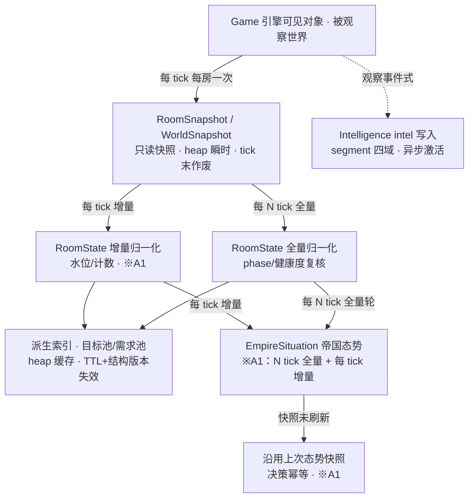
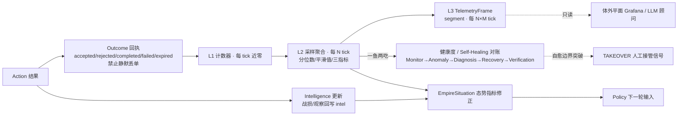

# DATA_FLOW · 数据流（冻结蓝图）

> 本文件是**数据流契约**：World→AI 感知流、Strategy→Execution 决策流、
> Execution→Strategy 反馈流三张主图，以及每张图的数据所有权与流向规则以此为准。
> 结构性修订必须走 ADR 并登记 [ARCHITECTURE_FREEZE.md](ARCHITECTURE_FREEZE.md) §15。
> 字段级所有权与 [STATE_OWNERSHIP_MODEL.md](STATE_OWNERSHIP_MODEL.md) §3 严格一致；
> 单 tick 内的**相位执行顺序**归 [TICK_LIFECYCLE.md](TICK_LIFECYCLE.md)（十相位，是
> research/26 §3 八步数据流的冻结层细化；本文件管跨 tick 的流向与归属，两者互补）。
> 依据：research/26 §3–§5、research/08 §10.2–10.3、research/21 §10.2、红队 A1/A8/A12。

## 1. 图一：World → AI（感知流，含分频标注）



感知流合同：

1. 快照是感知的**唯一入口**：角色与系统禁止全房 `find`，一律复用快照与派生索引
   （research/20 §10.6；AGENT.md）。
2. **禁止跨 tick 假设**：RoomSnapshot 每 tick 重建、tick 末作废；任何「上 tick 的
   快照还有效」的读取都是违规（STATE_OWNERSHIP §3.2）。
3. intel 是感知流的**慢速旁路**（segment，本 tick 请求下 tick 可读），禁止进入
   同 tick 生存决策（research/18 §7）。

**图一数据所有权与流向规则表**：

| 数据 | 产生者 | 消费者 | 存储 | 失效条件 |
| --- | --- | --- | --- | --- |
| RoomSnapshot / WorldSnapshot | World Model | 角色、各系统（只读） | heap（瞬时） | tick 末整体作废 |
| RoomState（phase/收支/人口/健康度） | World Model（唯一写者） | 任意（只读） | Memory 瘦字段 + heap 派生 | 增量每 tick / 全量每 N；房间注销整节删除 |
| 派生索引（目标池/需求池） | World Model | 分配服务、Logistics、Defense | heap 缓存条目 | TTL 到期 / 结构版本变化 / reset |
| EmpireSituation | Empire（聚合重建） | Policy、Agenda 复核 | heap（N 全量 + 每 tick 增量） | 每轮聚合重建；历史走遥测 |
| IntelEntry | Intelligence（唯一写者） | 扩张尽调、战争授权、市场 | segment 分页 | TTL 老化 + 置信度降级 + 环形覆盖 |

## 2. 图二：Strategy → Execution（决策流，环语义）

> 环语义（research/08 §10.3 修正点 1）：Policy 授权开 Agenda，**Agenda 与房间稳态
> 共同生成 Demand**；「Demand 在 Agenda 前」仅对触发立项的 Demand 成立。

```mermaid
flowchart TD
  GOAL[Goal 常量谓词集 · 编译期 · 不实例化] --> POLICY[Policy 纯函数<br/>posture × budget · 态势分频求值]
  SIT[EmpireSituation] --> POLICY
  POLICY -- 授权 + 预算 --> AGD[AgendaItem 立项/复核 · 低频<br/>预算/期限/取消条件/属地]
  AGD -- 生命周期内持续声明 --> DEM[Demand 请求池 · 每 tick 重推导<br/>heap 瞬时 · 不持久化]
  ROOM[房间六闭环稳态 · 缺口] -- 每 tick 确定性推导 --> DEM
  DEM --> ALLOC[分配层 ※A12 幂等]
  ALLOC -- census→intent · 稳定 key 合并排序 --> SPAWNM[SpawnManager<br/>spawnCreep 唯一写者]
  ALLOC -- 供需池→租约 --> LEASE[Task 租约 · 六态]
  DEM -- 建造申请标记 --> CONSM[Construction×2<br/>site 唯二写者]
  LEASE --> ACT[Action · 非移动动作直发]
  SPAWNM --> WORLD[(写游戏世界)]
  CONSM --> WORLD
  ACT -- 移动意图登记 --> TRAF[TrafficResolver · tick 末按房分桶仲裁<br/>※A8 意图网格索引 近似 O(n)] --> WORLD
```

决策流合同：

1. **目标选择权唯一**：图左侧到 Demand 的通路只有 Policy→（Agenda｜稳态）→Demand
   一条；任何绕过 Policy 新增「战略工作」的边都是违规（EMPIRE_SYSTEM_MODEL §3）。
2. **Demand 瞬时性**：每 tick 在 heap 重推导、tick 末丢弃；持久化例外仅「触发立项
   的转译字段」（调和 §2）。
3. **绑定仲裁唯一**：Agenda 从不点名 creep；Demand→Task 的绑定只发生在分配服务
   （research/08 §8）。
4. **写者收口**：通往 World 的出边**仅**四类——SpawnManager、Construction×2、
   TrafficResolver（move）、MarketManager（图中略，同构）+ 执行运行时直发的非移动
   动作（唯一写者语义下的角色动作出口）。

**图二数据所有权与流向规则表**：

| 数据 | 产生者 | 消费者 | 存储 | 失效条件 |
| --- | --- | --- | --- | --- |
| PostureDecision | Policy 求值（唯一） | 任意（只读） | Memory（仅切换 tick 写） | 态势分频刷新；滞回 + minDuration |
| AgendaItem | Agenda 管理器（立项授权仅 Empire） | 属地母房、遥测 | Memory O(active agendas) | 终态归档进 segment 后删除 |
| Demand | Agenda 声明 + 房间稳态推导（各系统） | 分配层、请求池消费者 | heap（瞬时） | tick 末丢弃；下一 tick 重导出 |
| SpawnIntent（幂等 key） | 各需求系统提交 | SpawnManager 合并消化 | Memory 队列 | 成交/撤销/过期清理 |
| Task 租约 | 分配服务（绑定唯一） | RolePolicy 执行 | Memory（targetId/租约小节） | 六态终态；TTL+heartbeat 回池 |
| TrafficState | TrafficResolver（唯一 move 签发者） | 仲裁器自身 | tick 内 heap | tick 末整体销毁 |

## 3. 图三：Execution → Strategy（反馈流）



反馈流合同：

1. **回执律**：一切 Intent/Request 必有 outcome，拒绝也落遥测（research/08 §8）；
   缺回执的写路径是评审红线（[GOAL_POLICY_PLAN_MODEL.md](GOAL_POLICY_PLAN_MODEL.md) §6）。
2. **取消不连锁**：任何一层取消不向上触发连锁取消——上层在自己的复核周期里发现
   下层 Outcome 变化（research/08 §10.4）；反馈流的「向上」只经遥测聚合与 intel，
   不存在同步回调。
3. **指标一鱼两吃**：L2 平滑值同时是自治算法输入与仪表盘数据，禁止第二套定义
   （research/21 §10.2）。
4. **体外只读**：EXTERNAL 读 segment，无任何写回边；挂掉不影响 tick 决策
   （research/21 §10.3；[LLM_BOUNDARY.md](LLM_BOUNDARY.md)）。

**图三数据所有权与流向规则表**：

| 数据 | 产生者 | 消费者 | 存储 | 失效条件 |
| --- | --- | --- | --- | --- |
| Outcome 回执 | 执行者 / 唯一写者上报 | 遥测、Agenda 复核 | L1 计数（heap） | L2 快照后清零 |
| L2 聚合值 | Observability | 门控、tuning、仪表盘 | heap + 并入 L3 | 每 N tick 快照滚动 |
| TelemetryFrame（L3） | Observability | 体外平面（只读） | segment | 滚动窗口 + 降采样 |
| 健康度 / 异常签名 | Self-Healing（监测寄生） | 恢复动作、TAKEOVER | 无自有业务状态（计数入遥测） | 处置后归零 |
| Intel 更新 | Intelligence（唯一写者） | Policy、扩张、战争授权 | segment | 同图一 TTL 规则 |

## 4. 红队修订回写位置标注

| 红队攻击 | 修订约束 | 在图中的落点 |
| --- | --- | --- |
| **A1**（战略层每 tick 全量聚合） | 分频聚合 + 快照未刷新沿用上次决策 | 图一 `EmpireSituation` 节点（N 全量 + 每 tick 增量）与 `沿用上次态势快照` 节点；图三 `态势指标修正` 边（进 Policy 前先聚合） |
| **A8**（tick 末仲裁 O(n²)） | 按房分桶 + 意图网格索引近似 O(n) | 图二 `TrafficResolver` 节点（分桶标注）；相位级语义见 [TICK_LIFECYCLE.md](TICK_LIFECYCLE.md) 相位 ⑧ |
| **A12**（重复成交/重复对象） | 幂等键 + 唯一写者 + 成交核验三件套 | 图二 `分配层`（稳定 key 合并）、`SpawnManager/Construction×2/MarketManager`（唯一写者收口）；Outcome 回执即成交核验的读侧（图三） |

## 5. 一致性声明

本文件三图与 [TICK_LIFECYCLE.md](TICK_LIFECYCLE.md) 十相位（图一 ≈ 相位 ①②③、
图二 ≈ 相位 ③–⑧、图三 ≈ 相位 ⑨）、[STATE_OWNERSHIP_MODEL.md](STATE_OWNERSHIP_MODEL.md)
§3 总表、[KERNEL_ARCHITECTURE.md](KERNEL_ARCHITECTURE.md) §2 管线序、
research/26 §3–§5 同一时刻必须一致；任何一处修订必须同步其余各处并走 ADR。
（[KERNEL_ARCHITECTURE.md](KERNEL_ARCHITECTURE.md) §9 所述「单 tick 八步数据流」
即 research/26 §3 原始八步；其执行序的冻结层表述以 [TICK_LIFECYCLE.md](TICK_LIFECYCLE.md)
十相位为准，两者是细化关系而非矛盾。）
