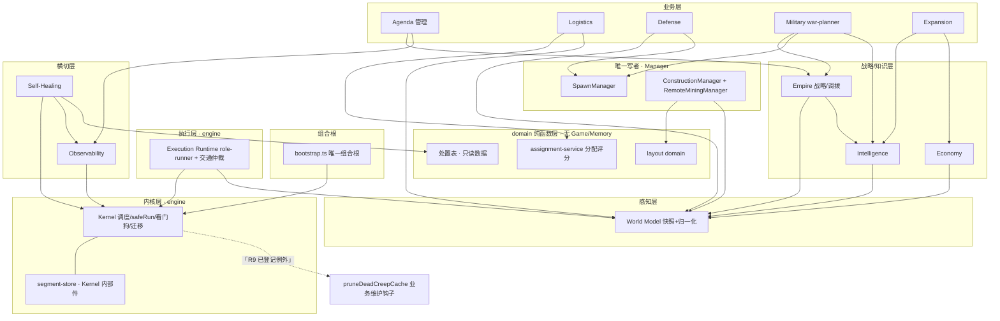

# DEPENDENCY_GRAPH · 依赖图（冻结蓝图）

> 本文件是**模块依赖契约**：15 个模块的合法依赖边、允许 / 禁止依赖全表与循环依赖
> 静态检查义务以此为准。结构性修订必须走 ADR 并登记
> [ARCHITECTURE_FREEZE.md](ARCHITECTURE_FREEZE.md) §15。本图与
> [SYSTEM_BOUNDARIES.md](SYSTEM_BOUNDARIES.md) §1 各模块 Dependencies 列**严格一致**
> （该列的每条边都必须能在 §1 图中找到，反之亦然）；接口级调用权限的镜像见
> [RUNTIME_API_DESIGN.md](RUNTIME_API_DESIGN.md) §6–§7。依据：research/19 §8、
> research/28 §10.3、红队 A4。

## 1. 模块依赖图（15 模块 + domain 纯函数层）

箭头方向 = 「A → B」表示 **A 运行时依赖 B**（调用 / 只读取数）。
「Kernel 遍历调用全部 System」是调度关系而非 import 依赖，不在图中画边。



对应 ASCII 骨架（分层视角，自下而上单向）：

```text
Kernel(engine) ← bootstrap 组合根；← Execution Runtime / Observability / Self-Healing
  ↑ 唯一反向边（R9 例外）：Kernel → pruneDeadCreepCache（虚线，3 钩子触发重构）
感知    World Model（无上游业务依赖）
战略    Empire → {World Model, Intelligence}；Economy → World Model；Intelligence → World Model
业务    Agenda → {Empire, Observability}；Logistics → {assignment-service, World Model}
        Defense → {World Model, Spawn(仅提交)}；Military → {Empire(只读), Spawn, Intelligence}
        Expansion → {Intelligence(只读), Economy(只读)}
写者    SpawnManager（无上游，被全体依赖）；Construction×2 → {layout domain, World Model}
执行    Execution Runtime → {Kernel(safeRun), World Model(快照只读)}
横切    Observability → {Kernel(采样只读), segment-store}；Self-Healing → {Kernel(错误签名), Observability, 处置表}
```

## 2. 允许依赖表（分层规则）

| # | 依赖方向 | 允许条件（仅当满足才允许） |
| --- | --- | --- |
| 1 | 任意模块 → Kernel | 经公开接口 `loop()/Registry/safeRun()/budgetTier()`；Kernel 内部件（如 segment-store）视同 Kernel 公开面 |
| 2 | 任意模块 → World Model | 只读消费快照 / RoomState / 派生索引；**禁止**写 World Model 状态 |
| 3 | System → domain Service | 纯函数调用（分配评分 / 布局计算 / 战略求值）；domain 层永不反向 |
| 4 | System → 唯一写者 | 仅当是对应提交方：Defense/Military → Spawn 提交请求；角色层 → Construction 仅申请标记 |
| 5 | System → Intelligence | 仅查询（Empire / Military / Expansion）；intel 写入恒在 Intelligence 内部 |
| 6 | 横切 → Kernel / Observability | 只读采样、错误签名消费；Self-Healing 恢复动作必须经对应 owner 公开接口 |
| 7 | Execution Runtime → Kernel / World Model | safeRun 与快照只读；**仅此两条**（SYSTEM_BOUNDARIES §1.2） |

新增依赖边的合并门槛：能在 §1 图与 [SYSTEM_BOUNDARIES.md](SYSTEM_BOUNDARIES.md)
Dependencies 列同步登记、且不落入 §3 任何一禁——三处同步缺一即驳回。

## 3. 禁止依赖清单（出现即架构违规）

| # | 禁止形态 | 依据 |
| --- | --- | --- |
| 1 | **Execution 反向依赖 Strategy**：Execution Runtime / RolePolicy import Empire、Agenda、Economy、Military 等战略与业务系统 | 执行层只消费快照与登记意图（SYSTEM_BOUNDARIES §1.2） |
| 2 | **Creep/RolePolicy 直达 SpawnManager / Construction**：直接提交孵化请求或调用 site 创建 | 只能经 Demand（census 推导）与申请标记（`needContainer`）；AGENT.md 角色条款 |
| 3 | **Room 逻辑直写 EmpireState**：posture / 预算 / 房间注册 / GCL 的写权唯一在 Empire | [STATE_OWNERSHIP_MODEL.md](STATE_OWNERSHIP_MODEL.md) §1/§3.1；两个系统同 tick 写 posture = 姿态撕裂 |
| 4 | **任何模块 import Kernel 内部**：绕过公开接口直取内核私有结构 | 只经 §2-1 公开面；Kernel 内部件重构不得波及业务 |
| 5 | **domain 层访问 Game / Memory**：决策函数体内出现 `Game.` / `RawMemory.` 引用 | 纯函数律（research/28 §10.3，与 ADR-004 同级红线）；Game 动作只允许出现在唯一写者与执行运行时 |
| 6 | **模块顶层访问 Game / Memory** | 组合根注入（AGENT.md bootstrap 条款） |
| 7 | **兄弟系统横向 import 直读内部状态** | 跨系统只经 Public Interface（SYSTEM_BOUNDARIES §2.3-2）；纯逻辑已下沉 `domain/layout/dismantle.ts`，link-system 仅保留 globalCache 操作封装作为 Public Interface |
| 8 | **Kernel import 业务模块** | research/19 §8；风险 R-13；唯一例外 = R9（KERNEL §8，「3 个钩子即 registry 化」） |
| 9 | **感知层依赖任何业务**：World Model import 战略 / 业务 / 执行模块 | 感知层是最上游（SYSTEM_BOUNDARIES §1.3）；引入将形成全图循环 |
| 10 | **写者间横向互调**：SpawnManager ↔ ConstructionManager ↔ TerminalManager 互 import | 唯一写者之间经各自队列 / 请求通道，不共享内部 |

## 4. 循环依赖的静态检查义务（红队 A4 的防线落地）

「架构防线是文档约定、运行时无人拦截」是已裁决成立的工程风险（红队 A4），防线
义务如下：

| # | 义务 | 形态 |
| --- | --- | --- |
| 1 | 循环依赖静态检查 | CI 必须运行 import 环检测（lint 规则族：`import/no-cycle` + 分区 `no-restricted-imports`），任何新增环即质量门槛红 |
| 2 | 边界 lint | 目录级规则：角色目录禁 `Room.find` / 全局扫描；`src/domain` 禁 `Game`/`Memory` 标识符；`src/kernel` 禁业务 import（R9 白名单一行） |
| 3 | 架构图回归测试 | 依赖审计工具（dependency-cruiser 类）以 §1 图为期望集做 diff：新增边不在 §2 表内即失败；15 模块集合变化必须先改本文 |
| 4 | 运行时断言 | 组合根注册时校验：名称全局唯一 kebab-case、RolePolicy 钩子签名齐全（research/30 A4） |
| 5 | 例外登记制度 | 任何非法边的豁免走 ADR + 触发器（R9 模式：「N 个即重构」，不是容忍上限） |
| 6 | 质量门槛 | 以上检查并入 `npm run typecheck` / `npm test` / `npm run build` 全绿链（AGENT.md 合并门槛） |

## 5. 一致性声明

本文件与 [SYSTEM_BOUNDARIES.md](SYSTEM_BOUNDARIES.md) §1 Dependencies 列 /
§2.3 最高禁令、[RUNTIME_API_DESIGN.md](RUNTIME_API_DESIGN.md) §6 权限矩阵、
[STATE_OWNERSHIP_MODEL.md](STATE_OWNERSHIP_MODEL.md) §1 红线同一时刻必须一致；
模块增删或依赖边变化必须四处同步并走 ADR。
