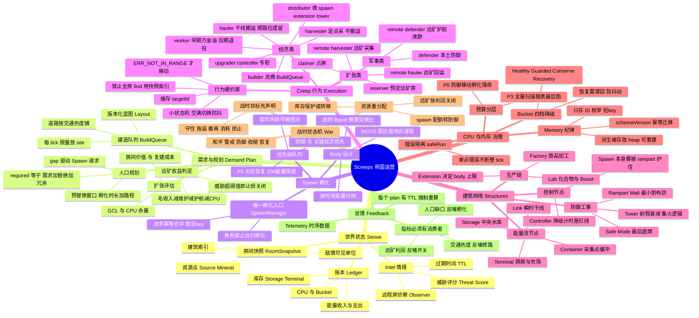
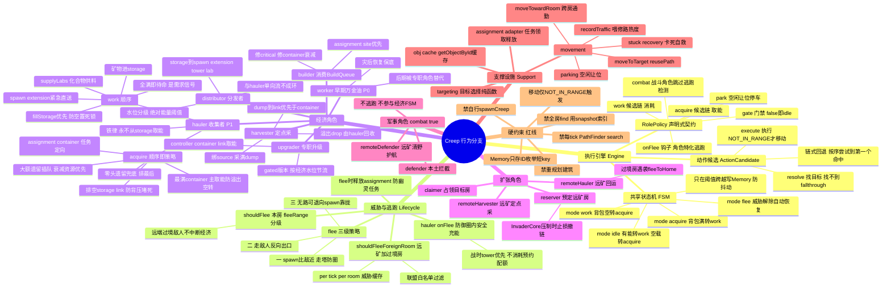
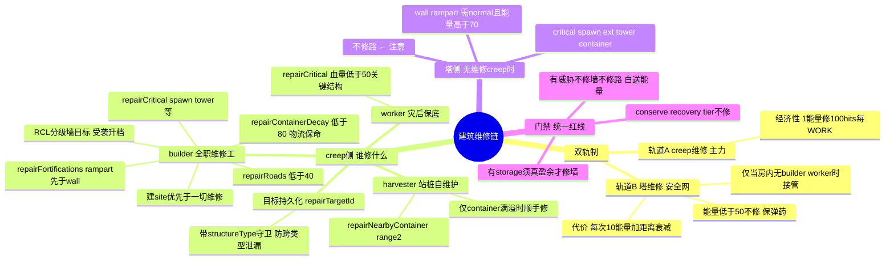

# 帝国运营思维导图

以资源流与决策闭环视角组织的全局导图，与仓库实际实现对齐。
三张图层层递进：帝国全局 → Creep 行为分支 → 建筑维修链。

- 角色实现：[src/creeps/roles/](../src/creeps/roles/)
- 执行引擎：[src/creeps/engine/](../src/creeps/engine/)
- 需求与调优：[src/domain/spawn/demand.ts](../src/domain/spawn/demand.ts)、[src/domain/tuning/](../src/domain/tuning/)
- 维修动作：[src/creeps/engine/actions/repair.ts](../src/creeps/engine/actions/repair.ts)、[src/systems/tower-defense.ts](../src/systems/tower-defense.ts)

## 一、帝国全局

纵向是闭环，不是清单：`Sense → Demand/Plan → Spawn → 执行 → Feedback → 重规划`。
任何分支若没有下游消费者，就是死指标。

## 二、Creep 行为分支

本项目的 creep 层是声明式动作管线：角色只声明 `acquire`/`work` 候选链，
统一由 role-runner 驱动，共享 FSM（acquire/work/idle/flee）在 lifecycle.ts。
链序即策略——候选顺序就是行为优先级。

## 三、建筑维修链

双轨制：creep 维修是主力（1 能量/100 hits/WORK），塔维修是安全网
（每次 10 能量 + 距离衰减，仅当房内无 builder/worker 时接管）。

## 已知裂缝备忘

勘探中确认的两处缺口（详情见对应勘探结论）：

| 编号 | 级别 | 描述 | 状态 |
| --- | --- | --- | --- |
| 裂缝一 | P1 | 成熟房 builder 随 site 归零消亡，道路无人修（塔不修路），只能塌毁重建——重建成本约为维修 6 倍，附带无路窗口期物流减速 | ✅ 已修：demand 增加道路维修需求信号（待修道路 ≥ 3 条时维持 1 个 builder，替换门禁同步放行） |
| 裂缝二 | P2 | 远矿 container 无维修链：衰减塌毁后靠满载自建重建（建造链已由 P0-A 补齐），塌毁-重建窗口期转 drop-mining 承受衰减损耗 | 已知取舍，暂不处理 |

另有一处注释与实现不符：demand.ts 中「tuning-engine 观测到 hauler 空闲」
实际接线是 container/link 空置率代理信号，TuningSignals 无 idle 字段。✅ 注释已修正。
